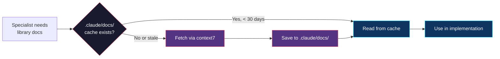
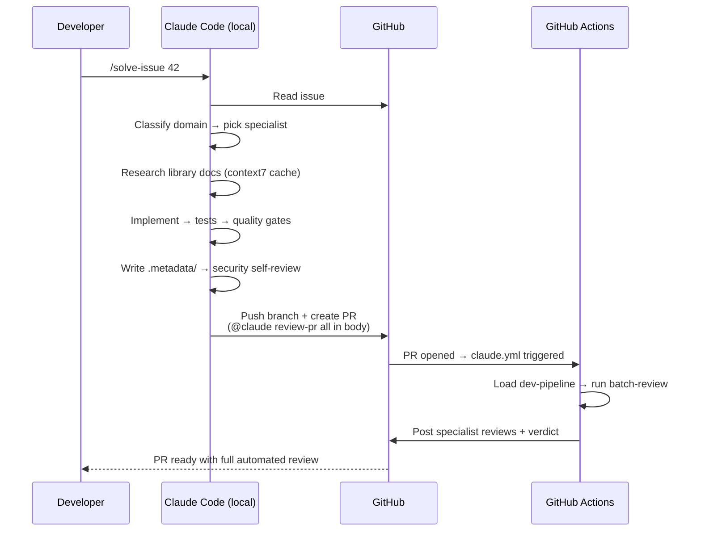

# dev-pipeline

> Autonomous development pipeline plugin for Claude Code.  
> Takes a GitHub issue from description to reviewed PR — no manual steps.

[](https://github.com/lucianfialho/claude-dev-pipeline/releases/tag/v1.0.0)
[](https://claude.ai/code)

---

## Install

Inside Claude Code:
```
claude plugin marketplace add lucianfialho/claude-dev-pipeline
claude plugin install dev-pipeline
```

Then solve your first issue:
```
/solve-issue 42
```

---

## What it does

```
/solve-issue 42
    ↓
Classify domain (frontend / backend / qa / ux / full-stack)
    ↓
Pick specialist → research library docs
    ↓
Implement → write tests → quality gates (test / lint / build)
    ↓
Write .metadata/ → security self-review → validate coverage
    ↓
Create PR → GitHub Actions runs batch-review automatically
```

---

## How it works

### 1. Domain classification

`solve-issue` reads the issue and picks the right specialist automatically:

| Issue type | Specialist |
|-----------|-----------|
| UI, components, pages, styling, a11y | `frontend-dev` |
| API endpoints, database, auth, server logic | `backend-dev` |
| Tests, coverage, flaky tests | `qa-engineer` |
| UX improvements, interaction design | `ux-designer` + `frontend-dev` |
| Full-stack feature | `backend-dev` then `frontend-dev` |
| Docs, config, CI/CD | Direct (no specialist) |

### 2. Library docs knowledge base

Before implementing, each specialist checks `.claude/docs/` for cached documentation. Stale or missing docs are fetched via [context7](https://github.com/VedanthB/context7-cli) and committed to the repo — so the whole team benefits from the cache.



### 3. Context management (`.metadata/`)

After every implementation, `solve-issue` writes a `.metadata/` folder alongside the modified source files and commits it in the same PR. Future sessions load metadata first instead of reading full source files.

```
src/components/NavBar/
  index.tsx
  .metadata/
    context.md   — what it does, key dependencies, patterns, caveats
    prompt.md    — origin issue, specialist, key decisions
    summary.md   — one line for fast context loading
```

`CLAUDE.md` maintains a **Component Registry** (auto-updated by `/context-sync`) — a table of all modules with one-line summaries that any session can scan to orient itself without reading source files.

### 4. Quality gates

Three hooks enforce quality before Claude stops or marks a task complete:

| Hook | Trigger | Action |
|------|---------|--------|
| **Stop** | Before Claude stops | Runs tests — blocks if they fail |
| **PostToolUse** | After Write/Edit | Async lint — reports issues via systemMessage |
| **TaskCompleted** | Before task closes | Runs build — blocks if it breaks |

Smart detection: if `npm test` is configured as `next build`, the test hook skips it (to avoid `.next/lock` conflicts with the build hook running simultaneously).

### 5. Automated PR review

`solve-issue` includes `@claude review-pr all` in the PR body. GitHub Actions picks this up and runs all specialists in parallel — no manual step needed.



---

## Skills

### Issue solving

| Skill | Description |
|-------|-------------|
| `/solve-issue [number]` | Classify domain, delegate to specialist, implement, verify, write metadata, create PR |
| `/solve-issue` | Pick the next open issue labeled `claude` |
| `/batch-issues` | Process all `claude`-labeled issues in parallel using agent teams |
| `/context-sync` | Update `.metadata/` for files changed in last commit + refresh Component Registry |
| `/context-sync full` | Rebuild `.metadata/` for all source directories |

### PR review

| Skill | Description |
|-------|-------------|
| `/review-pr all` | All specialists in parallel with unified verdict |
| `/review-pr frontend` | Components, a11y, performance, Server Components |
| `/review-pr backend` | API, database, auth, error handling |
| `/review-pr security` | OWASP Top 10, secrets, injection, auth gaps |
| `/review-pr ux` | Nielsen's heuristics, WCAG 2.1 AA, interaction |
| `/batch-review` | Same as `review-pr all` — runs on any PR number |
| `/check-security` | Deep security audit with dependency scan |
| `/suggest-tests` | Missing tests with skeleton code for edge cases |
| `/ux-review` | Full UX audit with prioritized recommendations |
| `/pr-summary` | Structured summary: changes, impact, review focus |
| `/validate-issue` | Verify PR covers all requirements from linked issue |

All review skills also work as `@claude <command>` in GitHub PR comments.

### Specialists

Each specialist researches up-to-date library docs before working. Used by `solve-issue` for implementation and by review skills for analysis.

| Specialist | Domain | Researches |
|------------|--------|------------|
| `frontend-dev` | React/Next.js, components, a11y, responsive | Framework, UI library, CSS tooling |
| `backend-dev` | APIs, database, auth, server logic | Framework, ORM, auth library |
| `qa-engineer` | Tests, edge cases, coverage | Test runner, mocking, assertion APIs |
| `ux-designer` | UX heuristics, accessibility, interaction | UI component library, a11y guidelines |
| `code-reviewer` | Bugs, security, performance, quality | Always included in reviews |

---

## GitHub Actions setup

Copy `.github/workflows/` from this repo to your project. Add one secret:

| Secret | Value |
|--------|-------|
| `CLAUDE_CODE_OAUTH_TOKEN` | Your Claude Code OAuth token |

Two workflows are included:
- **`claude.yml`** — responds to `@claude` mentions in issues, PR comments, and PR body
- **`claude-code-review.yml`** — automatic code review on every PR

---

## Review rules

Domain-specific rules are loaded based on changed file types:

| Rule set | Triggers on | Focus |
|----------|------------|-------|
| `base.md` | Always | Secrets, error handling, single responsibility |
| `frontend.md` | `.tsx`, `.jsx`, `.css` | Server Components, a11y, performance, design system |
| `backend.md` | `route.ts`, `actions.ts`, `api/` | Status codes, validation, queries, auth |
| `security.md` | Security reviews | Injection, secrets, auth, CSRF, CORS |
| `database.md` | `migration*`, `schema*`, `.prisma` | Migrations, N+1, transactions, indexes |
| `performance.md` | Performance reviews | Rendering, fetching, caching, assets |

Add a `REVIEW.md` to your repo root for project-specific rules — it's automatically loaded by all review skills.

---

## Configuration

All settings are optional. Create `pipeline.config.json` in your repo root to override defaults:

```json
{
  "$schema": "https://raw.githubusercontent.com/lucianfialho/claude-dev-pipeline/main/schemas/pipeline-config.schema.json",
  "specialists": {
    "defaults": ["code-reviewer"],
    "filePatterns": {
      "src/components/**": "frontend-dev",
      "src/api/**": "backend-dev",
      "**/*.test.*": "qa-engineer"
    }
  },
  "issues": {
    "label": "claude",
    "branchPrefix": "fix",
    "autoAssign": true
  },
  "batch": {
    "maxParallel": 3
  },
  "quality": {
    "requireTests": true,
    "requireBuild": true,
    "requireLint": true
  },
  "review": {
    "securityCheck": true,
    "performanceCheck": true,
    "maxFileReviewSize": 500
  }
}
```

| Section | Key | Default | Description |
|---------|-----|---------|-------------|
| `specialists` | `defaults` | `["code-reviewer"]` | Specialists that always run on reviews |
| `specialists` | `filePatterns` | `{}` | Map file globs to specialist roles |
| `issues` | `label` | `"claude"` | GitHub label for issue auto-discovery |
| `issues` | `branchPrefix` | `"fix"` | Branch naming prefix (`fix/42-description`) |
| `issues` | `autoAssign` | `true` | Auto-assign issue to @me when solving |
| `batch` | `maxParallel` | `3` | Max parallel agents in batch mode (1–10) |
| `quality` | `requireTests` | `true` | Block Stop hook if tests fail |
| `quality` | `requireBuild` | `true` | Block TaskCompleted if build fails |
| `quality` | `requireLint` | `true` | Report lint issues after file edits |
| `review` | `securityCheck` | `true` | Include security checklist in reviews |
| `review` | `performanceCheck` | `true` | Include performance checklist in reviews |
| `review` | `maxFileReviewSize` | `500` | Max lines per file to review |
