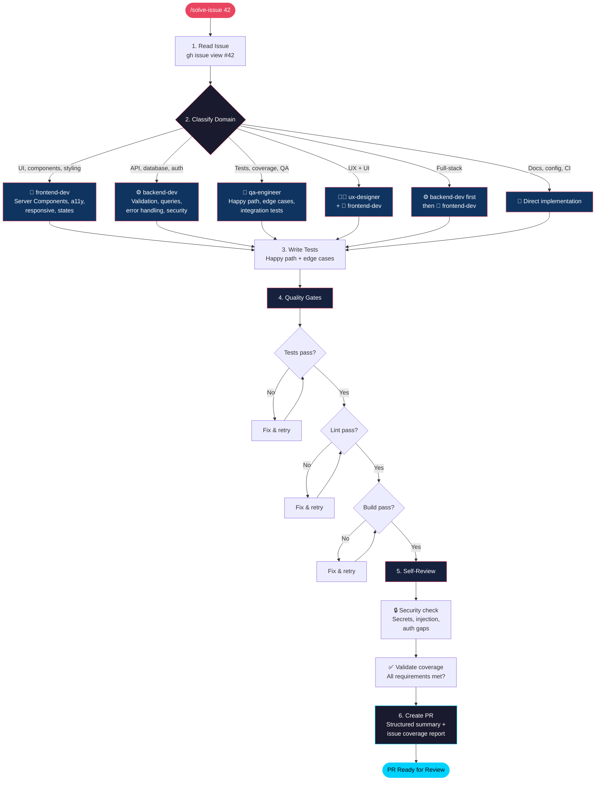

# dev-pipeline

An autonomous development pipeline plugin for Claude Code. Classifies issues by domain, delegates to specialist agents, enforces quality gates, and delivers verified PRs.

## How it works



## Install

Add the marketplace and install the plugin (inside Claude Code):
```
claude plugin marketplace add lucianfialho/claude-dev-pipeline
claude plugin install dev-pipeline
```

Or load directly from a local directory:
```bash
claude --plugin-dir /path/to/claude-dev-pipeline
```

## Skills

### Issue Solving

| Skill | Description |
|-------|-------------|
| `/solve-issue [number]` | Classify issue domain, delegate to specialist, implement, verify, and create PR |
| `/batch-issues` | Process multiple issues labeled "claude" in parallel using agent teams |

### PR Review

| Skill | Description |
|-------|-------------|
| `/review-pr [specialist]` | Targeted review: `frontend`, `backend`, `security`, `ux`, or `all` (parallel) |
| `/batch-review [pr_number]` | Run all applicable specialists in parallel with unified verdict |
| `/check-security [pr_number]` | OWASP Top 10, secrets, auth gaps, dependency audit |
| `/suggest-tests [pr_number]` | Missing tests, edge cases, regression risks with skeleton code |
| `/ux-review [pr_number]` | Nielsen's heuristics, WCAG 2.1 AA, interaction design |
| `/pr-summary [pr_number]` | Structured summary: changes, impact, review focus areas |
| `/validate-issue [pr_number]` | Verify PR covers all requirements from linked issue |

All review skills work as `@claude <command>` in GitHub PR comments.

### Specialists

These specialists are used by `solve-issue` for implementation and by review skills for analysis:

| Specialist | Domain | Used when |
|------------|--------|-----------|
| `frontend-dev` | React/Next.js, components, a11y, responsive | Issue involves UI, pages, styling |
| `backend-dev` | APIs, database, auth, server logic | Issue involves endpoints, data, security |
| `qa-engineer` | Tests, edge cases, coverage | Issue involves testing or coverage gaps |
| `ux-designer` | UX heuristics, accessibility, interaction | Issue involves UX improvements |
| `code-reviewer` | Bugs, security, performance, quality | Always included in reviews |

## Quality Gates (Hooks)

| Hook | When | What |
|------|------|------|
| **Stop** | Before Claude stops | Runs test suite — blocks if tests fail |
| **PostToolUse** (Write/Edit) | After file edits | Async lint check — reports issues |
| **TaskCompleted** | Before task closes | Runs build — blocks if build breaks |

## Review Rules

Domain-specific review rules are loaded based on changed file types:

| Rule Set | Triggers on | Focus |
|----------|------------|-------|
| `base.md` | Always | Secrets, error handling, single responsibility, code style |
| `frontend.md` | `.tsx`, `.jsx`, `.css` | Server Components, a11y, performance, design system |
| `backend.md` | `route.ts`, `actions.ts`, `api/` | Status codes, validation, queries, auth |
| `security.md` | Security reviews | Injection, secrets, auth, CSRF, CORS |
| `database.md` | `migration*`, `schema*`, `.prisma` | Migrations, N+1, transactions, indexes |
| `performance.md` | Performance reviews | Rendering, fetching, caching, assets |

Include `REVIEW.md` in your repo root for project-specific review rules. Works with Claude Code Review.

## Usage

```bash
# After installing, use the skills inside Claude Code:

# Solve a specific issue (classifies domain, picks specialist)
/dev-pipeline:solve-issue 42

# Or let Claude pick from labeled issues
/dev-pipeline:solve-issue

# Process all "claude" labeled issues in parallel
/dev-pipeline:batch-issues

# Review a PR with all specialists in parallel
/dev-pipeline:review-pr all

# Review with a specific specialist
/dev-pipeline:review-pr security

# Run security check on current PR
/dev-pipeline:check-security
```

## Configuration

Create a `pipeline.config.json` in your repo root to customize behavior:

```json
{
  "$schema": "https://raw.githubusercontent.com/lucianfialho/claude-dev-pipeline/main/schemas/pipeline-config.schema.json",
  "specialists": {
    "defaults": ["code-reviewer"],
    "filePatterns": {
      "src/components/**": "frontend-dev",
      "src/api/**": "backend-dev",
      "**/*.test.*": "qa-engineer",
      "**/*.tsx": "ux-designer"
    }
  },
  "issues": {
    "label": "claude",
    "branchPrefix": "fix",
    "autoAssign": true
  },
  "batch": {
    "maxParallel": 3
  },
  "quality": {
    "requireTests": true,
    "requireBuild": true,
    "requireLint": true
  },
  "review": {
    "securityCheck": true,
    "performanceCheck": true,
    "maxFileReviewSize": 500
  }
}
```

All fields are optional — defaults are used for anything not specified.

| Section | Key | Default | Description |
|---------|-----|---------|-------------|
| `specialists` | `defaults` | `["code-reviewer"]` | Specialists that always run on reviews |
| `specialists` | `filePatterns` | `{}` | Map file globs to specialists |
| `issues` | `label` | `"claude"` | GitHub label for issue discovery |
| `issues` | `branchPrefix` | `"fix"` | Branch naming prefix |
| `issues` | `autoAssign` | `true` | Auto-assign issues when solving |
| `batch` | `maxParallel` | `3` | Max parallel agents (1-10) |
| `quality` | `requireTests` | `true` | Run tests before stopping |
| `quality` | `requireBuild` | `true` | Run build before task completion |
| `quality` | `requireLint` | `true` | Run linter after file edits |
| `review` | `securityCheck` | `true` | Include security checklist |
| `review` | `performanceCheck` | `true` | Include performance checklist |
| `review` | `maxFileReviewSize` | `500` | Max lines per file to review |
